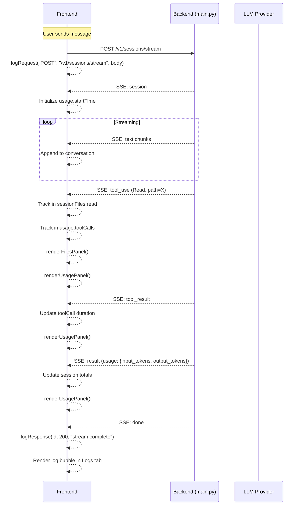

# Plan: Right Sidebar Panel — Files, Usage, Logs

## Current State

The right sidebar has three tabs (Files, Usage, Logs) defined in `index.html:195-230`:

| Tab | Current HTML | Current Behavior |
|-----|-------------|-----------------|
| **Files** | Two empty `<div>` lists: `#changed-files-list`, `#recent-files-list` | Never populated — no JS writes to these elements |
| **Usage** | Three `usage-card` divs: Context window, Session totals, Tool calls | `finalizeAssistantMessage` in `stream-handler.js:250-276` writes `input_tokens`, `output_tokens`, `cost`, `duration` to session totals. `#ctx-used` and `#tool-calls-list` are never populated. |
| **Logs** | Empty `rp-content` div | `addLogLine()` in `utils.js:25-33` appends lines, but only called for permission mode changes and model changes — not for API request/response traffic |

**State** (`state.js`) has no tracking for files, tool calls, or logs.

## Goal

Three improvements to the right sidebar:

1. **Files tab** — Track and display all files the Read and Write tools interact with during the session
2. **Usage tab** — Track tool call counts and per-tool timing; show cumulative session totals
3. **Logs tab** — Record every UI↔API request/response as a minimal speech bubble with an expand-to-modal button

---

## 1. Files Tab

### Data Model

Add to `state.js`:

```javascript
// state.js additions
sessionFiles: {
  read: new Map(),   // path → { count, lastAccess }
  written: new Map() // path → { count, lastAccess }
}
```

### Backend: Emit file paths from tool results

The backend already yields `tool_use` events with `input` containing `path` (for Read/Write/Replace) and `tool_result` events with output. No backend changes needed — the frontend can extract file paths from the existing `tool_use` events.

### Frontend: Track files in `stream-handler.js`

In `handleStreamEvent`, add a `tool_use` case enhancement:

```javascript
case 'tool_use':
  // ... existing tool block rendering ...
  
  // Track file interactions
  const toolName = (event.name || '').toLowerCase();
  const inputPath = event.input?.path;
  if (inputPath) {
    if (toolName === 'read') {
      const existing = state.sessionFiles.read.get(inputPath) || { count: 0 };
      existing.count++;
      existing.lastAccess = Date.now();
      state.sessionFiles.read.set(inputPath, existing);
    } else if (toolName === 'write' || toolName === 'replace') {
      const existing = state.sessionFiles.written.get(inputPath) || { count: 0 };
      existing.count++;
      existing.lastAccess = Date.now();
      state.sessionFiles.written.set(inputPath, existing);
    }
    renderFilesPanel();
  }
  break;
```

### Frontend: Render `renderFilesPanel()` in a new `files-panel.js` (or inline in `ui-components.js`)

```javascript
function renderFilesPanel() {
  const readList = document.getElementById('changed-files-list');
  const writeList = document.getElementById('recent-files-list');
  
  // "Changed files" = files written to
  writeList.innerHTML = '';
  for (const [path, info] of state.sessionFiles.written) {
    writeList.appendChild(makeFileItem(path, 'write', info.count));
  }
  if (!state.sessionFiles.written.size) {
    writeList.innerHTML = '<div style="font-size:11px;color:var(--text-2)">No files written yet</div>';
  }
  
  // "Recently read" = files read
  readList.innerHTML = '';
  for (const [path, info] of state.sessionFiles.read) {
    readList.appendChild(makeFileItem(path, 'read', info.count));
  }
  if (!state.sessionFiles.read.size) {
    readList.innerHTML = '<div style="font-size:11px;color:var(--text-2)">No files read yet</div>';
  }
}

function makeFileItem(path, type, count) {
  const div = document.createElement('div');
  div.className = 'file-tree-item';
  const basename = path.split(/[/\\]/).pop();
  div.innerHTML = `
    <span>${escapeHtml(basename)}</span>
    <span class="badge ${type === 'write' ? 'M' : 'A'}">${count}</span>
  `;
  div.title = path;
  return div;
}
```

### HTML Change

The existing `index.html` structure already has the right containers. The labels need a small swap: `#changed-files-list` should be "Written files" and `#recent-files-list` should be "Read files" (or keep as-is and just update the header text).

### No backend changes needed.

---

## 2. Usage Tab

### Data Model

Add to `state.js`:

```javascript
usage: {
  inputTokens: 0,
  outputTokens: 0,
  costUsd: 0,
  wallTimeMs: 0,
  toolCalls: [],  // { name, durationMs, timestamp }
  startTime: null
}
```

### Frontend: Track usage in `stream-handler.js`

In `handleStreamEvent`:

```javascript
case 'session':
  // ... existing ...
  state.usage.startTime = Date.now();
  break;

case 'tool_use':
  // ... existing ...
  state.usage.toolCalls.push({
    name: event.name,
    timestamp: Date.now(),
    durationMs: null  // filled on tool_result
  });
  renderUsagePanel();
  break;

case 'tool_result':
case 'tool_error':
  // Update last tool call duration
  const lastTool = state.usage.toolCalls[state.usage.toolCalls.length - 1];
  if (lastTool && !lastTool.durationMs) {
    lastTool.durationMs = Date.now() - lastTool.timestamp;
  }
  renderUsagePanel();
  break;

case 'result':
  // ... existing finalizeAssistantMessage ...
  if (event.usage) {
    state.usage.inputTokens = event.usage.input_tokens || 0;
    state.usage.outputTokens = event.usage.output_tokens || 0;
  }
  if (state.usage.startTime) {
    state.usage.wallTimeMs = Date.now() - state.usage.startTime;
  }
  renderUsagePanel();
  break;
```

### Frontend: Render `renderUsagePanel()`

Updates the existing `#tot-input`, `#tot-output`, `#tot-cost`, `#tot-time` elements, and populates `#tool-calls-list`:

```javascript
function renderUsagePanel() {
  document.getElementById('tot-input').textContent = state.usage.inputTokens || '–';
  document.getElementById('tot-output').textContent = state.usage.outputTokens || '–';
  
  const dur = state.usage.wallTimeMs;
  document.getElementById('tot-time').textContent = dur ? `${(dur / 1000).toFixed(1)}s` : '–';
  
  const toolList = document.getElementById('tool-calls-list');
  toolList.innerHTML = '';
  for (const tc of state.usage.toolCalls) {
    const row = document.createElement('div');
    row.className = 'usage-row';
    const durText = tc.durationMs != null ? `${(tc.durationMs / 1000).toFixed(1)}s` : '…';
    row.innerHTML = `<span>${escapeHtml(tc.name)}</span><b>${durText}</b>`;
    toolList.appendChild(row);
  }
}
```

### CSS Addition

```css
.tool-call-row {
  display: flex; justify-content: space-between;
  font-size: 12px; padding: 2px 0; color: var(--text-1);
}
.tool-call-row b { font-family: var(--mono); color: var(--text-0); }
```

### No backend changes needed — all data comes from existing SSE events.

---

## 3. Logs Tab — Request/Response Speech Bubbles with Modal

### Concept

Every API interaction (user message → SSE response, permission request → response, model change, etc.) gets logged as a compact "speech bubble" in the Logs tab. Each bubble shows:

- **Direction indicator**: `→` for UI→API, `←` for API→UI
- **Endpoint**: e.g., `POST /v1/sessions/stream`
- **Timestamp**
- **Preview**: First ~60 chars of the payload/response
- **Expand button**: Opens a modal with the full request/response JSON

### Data Model

Add to `state.js`:

```javascript
requestLogs: []  // { id, direction, endpoint, timestamp, request, response, status }
```

### Frontend: Intercept all API calls

The main interception points are:

1. **`stream-handler.js:sendToWrapper`** — the `fetch()` call to `/v1/sessions/stream`
2. **`api.js:dbFetch`** — all DB/control endpoints
3. **`api.js:sendApprovalResponse`** — permission responses

For `sendToWrapper`, wrap the fetch to capture request/response:

```javascript
// In sendToWrapper, before the fetch:
const requestBody = {
  message: userMessage,
  session_id: state.activeSessionId,
  model,
  planning_mode: options.planning || false,
  auto_approve: state.modeState.current === 'acceptEdits'
};

logRequest('POST', '/v1/sessions/stream', requestBody);

// After stream completes (in the try block, before setStreaming(false)):
logResponse(logId, 200, '(stream complete)');
```

For `dbFetch`, add logging:

```javascript
export async function dbFetch(path, opts = {}) {
  const logId = logRequest(opts.method || 'GET', path, opts.body ? JSON.parse(opts.body) : null);
  try {
    const res = await fetch(...);
    logResponse(logId, res.status, await res.clone().json().catch(() => null));
    return res.json();
  } catch (err) {
    logResponse(logId, 0, err.message);
    throw err;
  }
}
```

### Frontend: `logRequest()` and `logResponse()`

```javascript
function logRequest(method, endpoint, body) {
  const id = `log_${Date.now()}_${Math.random().toString(36).slice(2,6)}`;
  const entry = {
    id, direction: 'request', method, endpoint,
    timestamp: Date.now(),
    body: body,
    status: null,
    response: null
  };
  state.requestLogs.push(entry);
  renderLogBubble(entry);
  return id;
}

function logResponse(id, status, response) {
  const entry = state.requestLogs.find(e => e.id === id);
  if (!entry) return;
  entry.status = status;
  entry.response = response;
  // Update the existing bubble
  updateLogBubble(entry);
}
```

### Frontend: Speech Bubble Rendering

Each log entry renders as a compact row:

```html
<div class="log-bubble" data-log-id="log_xxx">
  <span class="log-dir">→</span>
  <span class="log-endpoint">POST /v1/sessions/stream</span>
  <span class="log-status">200</span>
  <span class="log-preview">{"message": "use your bash tool..."</span>
  <button class="log-expand" title="View full request/response">⋯</button>
</div>
```

The expand button opens a modal:

```javascript
function openLogModal(entry) {
  const overlay = document.createElement('div');
  overlay.className = 'modal-overlay';
  overlay.innerHTML = `
    <div class="modal">
      <div class="modal-header">
        <span>${entry.method} ${entry.endpoint}</span>
        <span class="log-status-badge ${entry.status < 400 ? 'ok' : 'err'}">${entry.status || 'pending'}</span>
        <button class="modal-close">&times;</button>
      </div>
      <div class="modal-body">
        <div class="modal-section">
          <h4>Request</h4>
          <pre>${escapeHtml(JSON.stringify(entry.body, null, 2))}</pre>
        </div>
        <div class="modal-section">
          <h4>Response</h4>
          <pre>${escapeHtml(JSON.stringify(entry.response, null, 2)) || 'Pending...'}</pre>
        </div>
      </div>
    </div>
  `;
  overlay.querySelector('.modal-close').addEventListener('click', () => overlay.remove());
  overlay.addEventListener('click', (e) => { if (e.target === overlay) overlay.remove(); });
  document.body.appendChild(overlay);
}
```

### CSS Additions

```css
/* Log speech bubbles */
.log-bubble {
  display: flex; align-items: center; gap: 6px;
  padding: 4px 8px; margin-bottom: 4px;
  background: var(--bg-2); border: 1px solid var(--border);
  border-radius: var(--radius); font-size: 11px;
  font-family: var(--mono); cursor: default;
}
.log-bubble:hover { border-color: var(--bg-4); }
.log-dir { font-weight: 700; flex-shrink: 0; }
.log-dir.out { color: var(--accent); }
.log-dir.in { color: var(--ok); }
.log-endpoint { color: var(--text-1); flex-shrink: 0; }
.log-status { color: var(--text-2); flex-shrink: 0; min-width: 24px; text-align: center; }
.log-status.ok { color: var(--ok); }
.log-status.err { color: var(--err); }
.log-preview {
  color: var(--text-2); overflow: hidden; text-overflow: ellipsis;
  white-space: nowrap; flex: 1; min-width: 0;
}
.log-expand {
  flex-shrink: 0; background: var(--bg-3); border: none;
  color: var(--text-1); border-radius: 4px; padding: 1px 6px;
  cursor: pointer; font-size: 12px;
}
.log-expand:hover { background: var(--bg-4); color: var(--text-0); }

/* Modal overlay */
.modal-overlay {
  position: fixed; inset: 0; background: rgba(0,0,0,0.6);
  display: flex; align-items: center; justify-content: center;
  z-index: 1000;
}
.modal {
  background: var(--bg-1); border: 1px solid var(--border);
  border-radius: var(--radius); width: 90%; max-width: 700px;
  max-height: 80vh; display: flex; flex-direction: column;
}
.modal-header {
  display: flex; align-items: center; gap: 8px;
  padding: 12px 16px; border-bottom: 1px solid var(--border);
  font-size: 13px; font-weight: 600;
}
.modal-close {
  margin-left: auto; background: none; border: none;
  color: var(--text-2); font-size: 18px; cursor: pointer;
}
.modal-body {
  flex: 1; overflow-y: auto; padding: 16px;
}
.modal-section { margin-bottom: 16px; }
.modal-section h4 {
  font-size: 11px; text-transform: uppercase; letter-spacing: 0.5px;
  color: var(--text-2); margin-bottom: 6px;
}
.modal-section pre {
  background: var(--bg-2); border: 1px solid var(--border);
  border-radius: var(--radius); padding: 10px 12px;
  font-family: var(--mono); font-size: 11px; color: var(--text-1);
  overflow-x: auto; white-space: pre-wrap; word-break: break-word;
  max-height: 300px; overflow-y: auto;
}
.log-status-badge {
  font-size: 10px; padding: 1px 6px; border-radius: 8px; font-weight: 700;
}
.log-status-badge.ok { background: rgba(137,209,133,0.15); color: var(--ok); }
.log-status-badge.err { background: rgba(244,135,113,0.15); color: var(--err); }
```

### Backend: No changes needed

All log data comes from the frontend intercepting its own fetch calls.

---

## Files to Modify

| File | Change |
|------|--------|
| `state.js` | Add `sessionFiles`, `usage`, `requestLogs` |
| `stream-handler.js` | Track files, usage, and log API calls in event handlers |
| `api.js` | Add request/response logging to `dbFetch` and `sendApprovalResponse` |
| `ui-components.js` | Add `renderFilesPanel()`, `renderUsagePanel()`, `renderLogBubble()`, `openLogModal()` |
| `utils.js` | Update `addLogLine()` or replace with new log bubble system |
| `index.html` | Minor: update Files tab header labels |
| `styles.css` | Add `.log-bubble`, `.modal-overlay`, `.modal`, `.log-status-badge` styles |

## No Backend Changes

All three features are frontend-only. The backend already provides:
- `tool_use` events with `input.path` (for file tracking)
- `result` events with `usage` (for token counts)
- SSE event types (for log interception)

## Sequence Diagram


