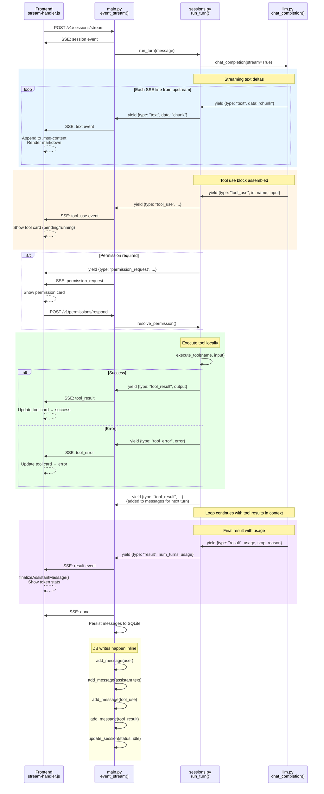

```mermaid
sequenceDiagram
    participant UI as Frontend<br/>stream-handler.js
    participant API as main.py<br/>event_stream()
    participant SES as sessions.py<br/>run_turn()
    participant LLM as llm.py<br/>chat_completion()

    UI->>API: POST /v1/sessions/stream
    API->>UI: SSE: session event

    API->>SES: run_turn(message)
    SES->>LLM: chat_completion(stream=True)

    rect rgb(230, 245, 255)
        Note over LLM,SES: Streaming text deltas
        loop Each SSE line from upstream
            LLM->>SES: yield {type: "text", data: "chunk"}
            SES->>API: yield {type: "text", data: "chunk"}
            API->>UI: SSE: text event
            UI-->>UI: Append to .msg-content<br/>Render markdown
        end
    end

    rect rgb(255, 245, 230)
        Note over LLM,SES: Tool use block assembled
        LLM->>SES: yield {type: "tool_use", id, name, input}
        SES->>API: yield {type: "tool_use", ...}
        API->>UI: SSE: tool_use event
        UI-->>UI: Show tool card (pending/running)
    end

    alt Permission required
        SES->>UI: yield {type: "permission_request", ...}
        API->>UI: SSE: permission_request
        UI-->>UI: Show permission card
        UI->>API: POST /v1/permissions/respond
        API->>SES: resolve_permission()
    end

    rect rgb(230, 255, 230)
        Note over SES: Execute tool locally
        SES->>SES: execute_tool(name, input)
        alt Success
            SES->>API: yield {type: "tool_result", output}
            API->>UI: SSE: tool_result
            UI-->>UI: Update tool card → success
        else Error
            SES->>API: yield {type: "tool_error", error}
            API->>UI: SSE: tool_error
            UI-->>UI: Update tool card → error
        end
    end

    SES->>API: yield {type: "tool_result", ...}<br/>(added to messages for next turn)

    Note over SES,LLM: Loop continues with tool results in context

    rect rgb(245, 230, 255)
        Note over LLM,SES: Final result with usage
        LLM->>SES: yield {type: "result", usage, stop_reason}
        SES->>API: yield {type: "result", num_turns, usage}
        API->>UI: SSE: result event
        UI-->>UI: finalizeAssistantMessage()<br/>Show token stats
    end

    API->>UI: SSE: done
    API->>API: Persist messages to SQLite

    rect rgb(255, 255, 230)
        Note over API: DB writes happen inline
        API->>API: add_message(user)
        API->>API: add_message(assistant text)
        API->>API: add_message(tool_use)
        API->>API: add_message(tool_result)
        API->>API: update_session(status=idle)
    end
```